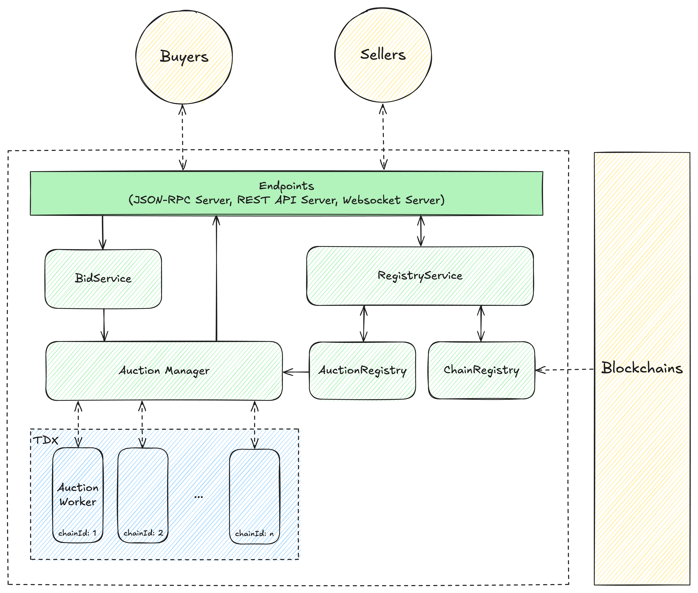

# Lightbulb

## Description

Lightbulb is a Secure Block Building System built in Rust. Block Sequencers can sell their blocks to the Lightbulb. The Lightbulb will then open auctions for the blocks. Buyers who want to buy the block space can bid on the blocks.

The Lightbulb will then select the order of the blocks based on the bids. This process is executed in the Trusted Execution Environment (TEE) to ensure that the process is secure and tamper-proof.

## Architecture



## Installation

1. **Clone the Repository**

    ```bash
    git clone https://github.com/radiusxyz/lightbulb.git
    cd lightbulb
    ```

2. **Build the Project**

    ```bash
    cargo build --release
    ```

## Running the Application

You can run the application using Cargo or by executing the built binary directly.

1. **Using Cargo**

    ```bash
    cargo run --release
    ```

2. **Using the Built Binary**

    ```bash
    ./target/release/lightbulb
    ```
